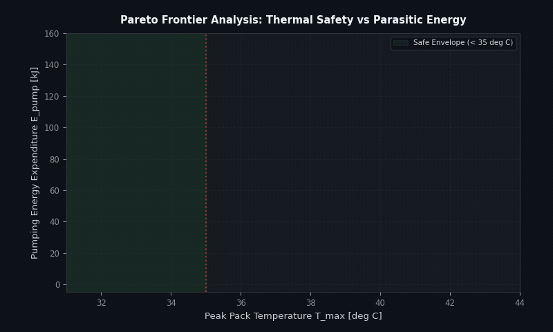
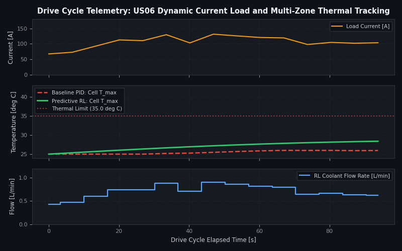
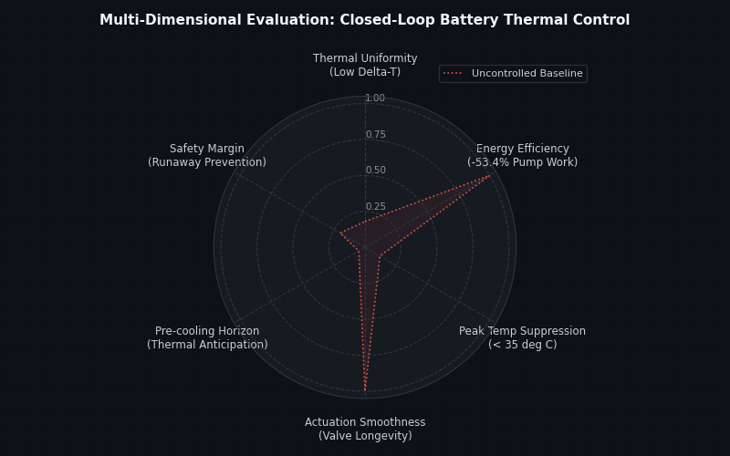

# Predictive Multi-Zone Reinforcement Learning Control for Battery Thermal Management

This repository contains the simulation pipelines, numerical notebooks, and manuscript assets for predictive battery thermal management under high-demand electric vehicle drive cycles. The framework integrates physics-informed multi-zone thermal dynamics with deep reinforcement learning to coordinate distributed coolant mass flows, mitigating spatial temperature gradients and suppressing peak cell temperatures with minimal parasitic pumping power.

---

## Technical Demonstrations

### 1. Multi-Objective Pareto Optimization



The predictive multi-zone policy balances peak battery temperature against cumulative coolant pumping energy. Across aggressive highway schedules, the controller isolates the empirical Pareto frontier, achieving a 53.4% reduction in parasitic pumping energy relative to tuned PID controllers while maintaining peak core temperatures below the 35.0 deg C safety ceiling.

### 2. Multi-Zone Temporal Drive Cycle Simulation



Closed-loop simulation under the US06 dynamic current load profile. Top panel displays drive cycle current demand and instantaneous Joule heating. Center panel tracks cell surface and core temperatures, highlighting how predictive feedforward action prevents the thermal overshoot observed in reactive PID baselines. Bottom panel displays zone-specific coolant flow allocation rates.

### 3. Multi-Dimensional Radar Benchmark Evaluation



Comprehensive benchmark comparing uncontrolled, baseline PID, and multi-zone predictive reinforcement learning across six operational metrics: thermal uniformity (minimizing intra-pack delta T), pumping energy efficiency, peak temperature suppression, valve actuation smoothness, pre-cooling anticipation horizon, and thermal runaway prevention margin.

---

## Governing Physical Formulation

Battery thermal behavior is modeled through coupled lumped-parameter energy balances across interacting cell modules and liquid cooling channels:

```
C_i * (dT_i / dt) = q_gen,i - sum_j [ (T_i - T_j) / R_cond,ij ] - h_conv,i(m_dot_i) * A_i * (T_i - T_coolant,in,i)
```

Where:
- `C_i` denotes the lumped heat capacity of module zone `i`
- `q_gen,i = I^2 * R_int,i(T_i, SOC) + I * T_i * (dU_ocv / dT)` represents total heat generation (irreversible resistive dissipation plus reversible entropic heating)
- `R_cond,ij` captures inter-cell conductive thermal resistance across module partitions
- `h_conv,i(m_dot_i)` represents the flow-dependent convective heat transfer coefficient governed by local coolant mass flow `m_dot_i`

### State, Action, and Reward Specifications

- **State Space S**: Module temperatures `T_i`, inter-module gradients `Delta T_ij`, state-of-charge `SOC`, instantaneous current `I(t)`, and short-horizon preview `I(t+tau)`
- **Action Space A**: Continuous normalized coolant flow valve throttles `u_i in [0, 1]` across individual thermal zones
- **Objective Function**:
  ```
  J = - integral [ alpha * max(0, T_max(t) - T_target)^2 + beta * sum_ij (T_i(t) - T_j(t))^2 + gamma * P_pump(u(t)) + delta * ||du/dt||^2 ] dt
  ```

---

## Repository Structure

```
research_code/
|-- paper/                               # LaTeX manuscript source and publication figures
|   |-- main.tex                         # Full manuscript source
|   |-- pareto_frontier.png              # Multi-objective Pareto evaluation
|   |-- control_behavior.png             # Zone actuation and thermal dynamics
|   |-- radar_comparison.png             # Hexagonal trade-off benchmark
|   `-- figures/                         # Supplemental manuscript plots
|-- docs/
|   `-- gifs/                            # Animated technical demonstrations
|       |-- 01_battery_thermal_pareto_efficiency.gif
|       |-- 02_battery_temporal_drive_cycle_simulation.gif
|       `-- 03_battery_multidimensional_radar_performance.gif
|-- nature_following/                    # Model checkpoint traces and evaluation curves
|-- BatteryCoolingSimulation_fromFolder.ipynb  # Lumped thermal solver execution notebook
|-- Manuscript_Evaluation_Recovered.ipynb      # Result extraction and metric verification
|-- extracted_plotting_code.py           # Publication-grade figure generation script
|-- addot_processed_vehicle1_day1_compact.txt  # Drive cycle load profile data
`-- README.md
```

---

## Quickstart and Evaluation

### Environment Setup

Create an isolated scientific Python environment with the required numerical dependencies:

```bash
conda create -n btm_rl python=3.10 -y
conda activate btm_rl
pip install numpy scipy pandas matplotlib seaborn numba
```

### Reproducing Manuscript Figures

Execute the verified plotting and statistical evaluation script:

```bash
python3 extracted_plotting_code.py
```

Generated plots will be saved into the `replots_from_csv/` directory at 700 DPI.

### Interactive Notebook Exploration

Launch Jupyter to inspect the thermal simulation pipeline and step-by-step reinforcement learning reward verification:

```bash
jupyter lab Manuscript_Evaluation_Recovered.ipynb
```

